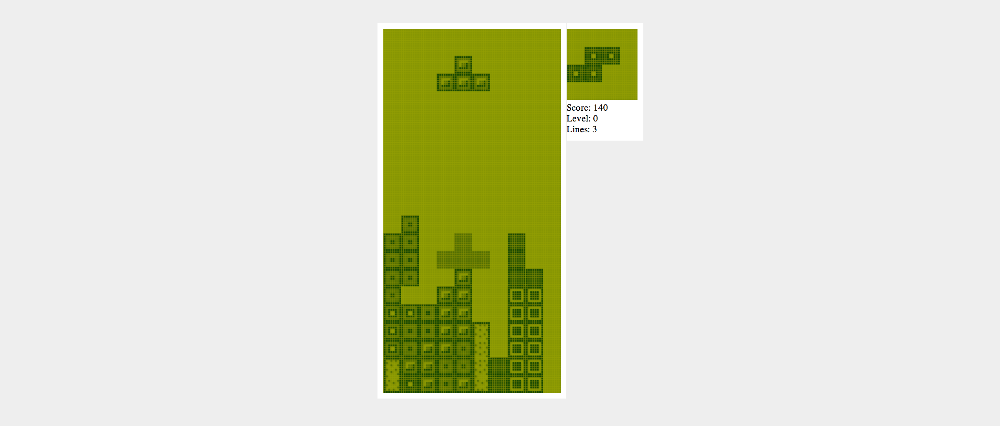

# T3TR0S-bare

This is a bare version of single player
[T3TR0S](http://github.com/imalooney/t3tr0s), because we miss the accessibility
and simplicity of its code before features become a priority.  Oh, and it's in
[ClojureScript](https://github.com/shaunlebron/ClojureScript-Syntax-in-15-minutes).



## Setup

1. Install [Leiningen](http://leiningen.org)
1. Run `lein figwheel dev`.
1. Open <http://localhost:3449>.

## Play with the REPL

Use Figwheel's REPL for interacting with the running game with:

__Press "P" in-game to pause the gravity__.  This allows us to play with the
game state without gravity progressing the game.

Go into the game's core namespace:

```
> (in-ns 'game.core)
```

You can set the current piece to use any of the following keys `:I :T :O :Z :S
:J :L`.  The letters represent the shapes of the canonical pieces.

```
> (swap! state assoc :piece (:I game.board/pieces))
```

Go back to your game to see how the piece changed to the line-piece.  You can
modify any part of the game this way.
